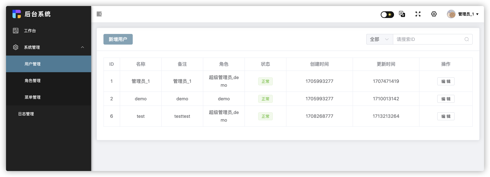

# Vue 3 + Vite + Element-Plus 的 后台 管理系统 - backEnd


## 展示图



## 使用
1. clone 项目，直接运行 `npm run dev` 就能使用 [使用的是 mock api数据]
2. 如果使用 真实 api 接口，需要更改 src/core/settings/projectSetting.js文件中的配置，设置如下：
```sh
# 将 isMockApi 设置 为 false, 默认是 true
isMockApi: false
```
3. ddd

## 内置功能
1. 设置(主题、多语言、全屏、排版等等)
2. 系统管理(菜单管理、用户管理、角色管理)
